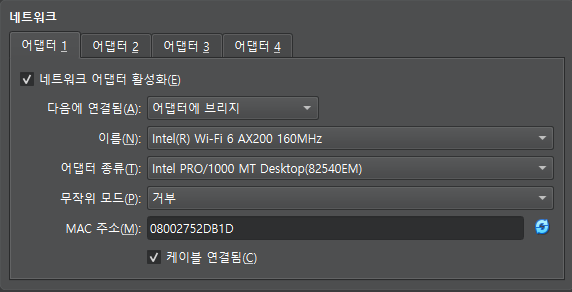

## VM 할당
| Virtual Machine | CPU Core | RAM | 저장공간 | 설명 |
| --- | --- | --- | --- | --- |
| Zookeeper | 1 | 3GB | 25GB |  |
| Kafka | 1~2 | 4GB | 40GB | CPU는 2코어를 최소로 잡지만 테스트 용도로 1코어만 주었습니다. |
| **Ubuntu Server | 1 | 512MB | 2.5GB | Zookeeper와 Kafka에 모두 적용되는 기본 OS입니다. |

## VM 네트워크 수정

각 네트워크는...
- NAT
  - 사설 IP → 공인 IP
- 어댑터에 브릿지
  - VM을 네트워크에 직접 연결
- 내부 네트워크
  - 가능: VM ↔ VM
  - 불가능: VM ↔ 외부
- 호스트 전용 어댑터
  - 가능: Host ↔ VM
  - 불가능 VM ↔ 외부
- 일반 드라이버
  - 특정 하드웨어에 종속되지 않는 드라이버
- NAT 네트워크
  - 가상 머신이 NAT를 통해 외부 인터넷과 통신할 수 있도록 하는 네트워크 설정
  - 가능: VM ↔ VM, VM → 외부
  - 불가능: 외부 → VM

## 스크립트 수정
자신의 vm에 맞게 ip table을 수정합니다.  
현재 스크립트에 작성된 내용은 제 pc의 vm 기준으로 작성되어있습니다.

## 스크립트 실행
kafka-rest를 제외한 모든 스크립트는 `setup-***.sh $1`으로 입력받습니다.   
`$1`에는 kafka_id 또는 zookeeper_id를 넣어줍니다.

## systemd
/etc/systemd/system 디렉터리에 service를 만들고 해당하는 systemd.txt를 추가합니다.
이후 `systemctl daemon-reload` -> `systemctl start {{ service name }}`을 입력하여 정상 실행되는지 확인합니다.
정상 실행 확인 후 `systemctl enable {{ service name }}`을 통해 서버 실행 시 자동으로 켜지도록 합니다.